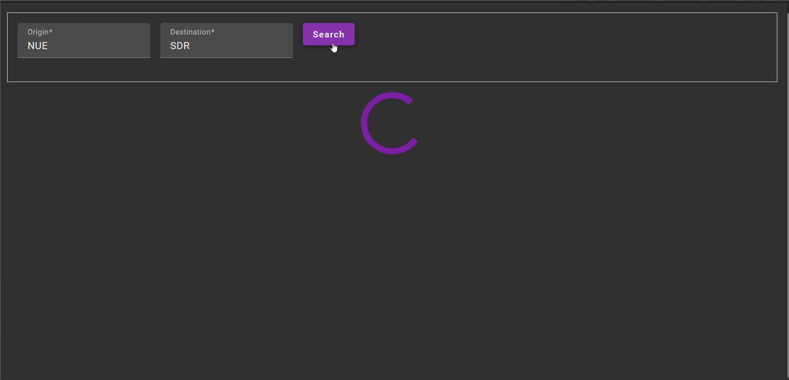
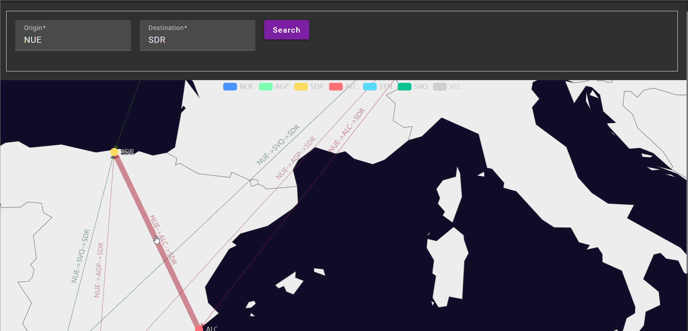

# Flight combination finder

This app is created with the goal of saving time searching cheaper flights.

If you want to fly with a low cost airline and you there is not a direct connection to the airport, you have to do the following steps to find a flight:

1. You have to search which connections are possible by going through the different airports that connect from the first airport, and seeing if there is a connection to your end destination.
1. You have to search each flight individually for the connection.
1. You have to compare the landing date of the first one with the departure date of the second one.
1. You have to repeat the process for many dates to find the cheapest one.

This app tries to solve this problem by:

1. Showing which connections are possible between two airports with a maximum of one stop:



1. Showing for a time range (e.g. 1 month), which days have a connection:



## Airlines

The app currently has the following airlines implemented. An extension would be possible depending on the availability of the airline API's.:

* ✅ Ryanair

## Usage

1. Pull this project or copy the `docker-compose.yaml` and `.env` files.
1. Add a certificate or create a self signed certificate to an `ssl` folder:

    ```bash
    ├── docker-compose.yaml
    ├── .env
    └── ssl
        ├── cert.key
        └── cert.pem
    ```

1. Start the docker stack with `docker compose up -d`.
1. The server should accessible in your IP.
